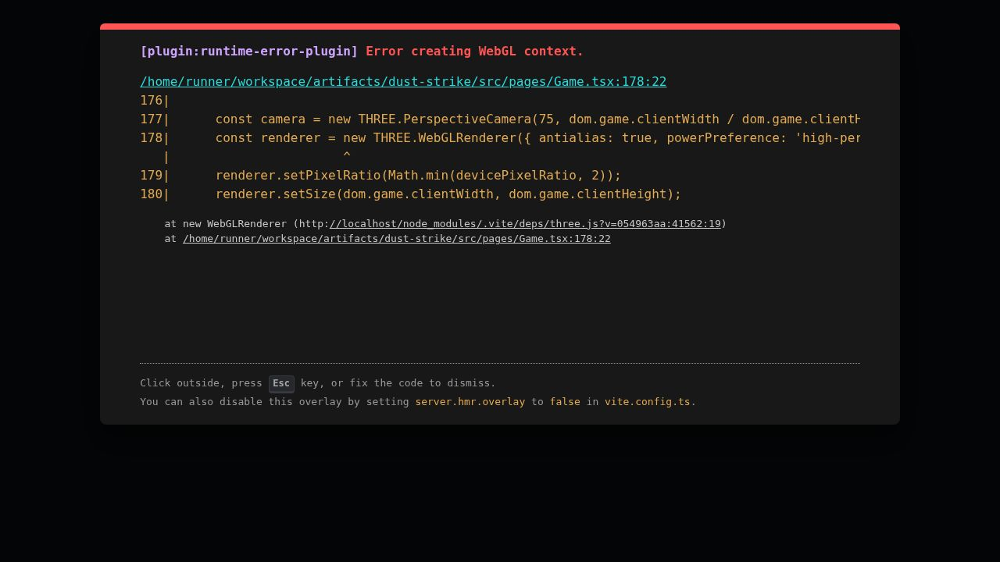

# CS2 Web

Live project: [cs2-web-three.vercel.app](https://cs2-web-three.vercel.app)



A browser-based tactical FPS prototype built with React, TypeScript, Three.js, and Vite.

The project aims to capture the feel of a 5v5 round-based defusal shooter in the browser while gradually extracting the prototype into cleaner, testable systems for match rules, AI, weapons, maps, audio, and rendering.

## Current State

- Playable first-person browser prototype with lobby, pointer-lock aiming, shooting, bots, bomb plant/defuse flow, buy phase, scoreboard, and spectator flow.
- Main gameplay shell currently lives in [`src/pages/Game.tsx`](./src/pages/Game.tsx), which is still a large prototype file.
- Several gameplay systems have already been pulled into standalone TypeScript modules with tests:
  - Match rules and economy
  - Weapon catalog validation
  - Tactical AI scoring and bot difficulty profiles
  - Adaptive renderer quality control
  - Lazy WebAudio bootstrapping
  - Tactical map manifest validation
- The active playable map is still hardcoded around Harbor Exchange, while the broader map pipeline is being prepared through the manifest and asset system.

## Tech Stack

- React 19
- TypeScript
- Three.js
- Vite
- Node built-in test runner

## Getting Started

### Requirements

- Node.js 22+ recommended
- npm

### Install

```bash
npm install
```

### Run locally

```bash
npm run dev
```

Vite serves the game on `http://localhost:5173`.

## Available Scripts

- `npm run dev` starts the local dev server on `0.0.0.0:5173`
- `npm test` runs the TypeScript node tests
- `npm run typecheck` runs `tsc --noEmit`
- `npm run build` creates the production build in `dist/`
- `npm run serve` previews the built app locally

## Controls

- `W A S D` move
- `Mouse` aim
- `Left Click` fire
- `1 / 2 / 3` switch weapon slots
- `B` open or close buy menu during freeze time
- `E` interact, plant, or defuse
- `Shift` walk
- `Ctrl` crouch
- `Space` jump
- `Tab` scoreboard

## Project Structure

```text
src/
  ai/                 Tactical director and behavior logic
  audio/              WebAudio runtime
  engine/             Loop and input helpers
  gameplay/           Match and physics systems
  maps/               Map manifest and loading
  pages/              React page shell, including the main game prototype
  rendering/          Renderer utilities and adaptive quality
  weapons/            Weapon catalog and validation
tests/                Node-based verification for extracted systems
public/assets/        Static maps, models, textures, and asset docs
public/draco/         Draco decoder files for compressed GLB loading
docs/                 Production notes and implementation plans
```

## Implemented Systems

### Gameplay

- 5v5 team setup with CT/T sides
- Freeze time, live rounds, planted bomb phase, round resolution, halftime logic, and overtime-ready match state in [`src/gameplay/match/MatchRules.ts`](./src/gameplay/match/MatchRules.ts)
- Economy and loss-bonus handling
- Buy menu and loadout flow
- Bomb plant and defuse loop
- Spectator fallback after death

### AI

- Difficulty-driven bot profiles from `easy` through `pro`
- Tactical option scoring for cover, reload, engage, rotate, sound investigation, and objective play
- Enemy memory decay helpers

### Weapons

- Typed weapon catalog for pistols, rifles, SMGs, AWP, knife, and utility
- Spread, recoil, reload, movement, armor penetration, reward, and utility metadata in [`src/weapons/WeaponData.ts`](./src/weapons/WeaponData.ts)

### Rendering and Audio

- Three.js first-person scene with procedural materials and stylized environment lighting
- Adaptive pixel-ratio scaling for weaker hardware
- Lazy WebAudio initialization to avoid eager `AudioContext` startup
- Draco loader wiring for compressed map assets

### Maps and Assets

- Tactical map manifest for four themes:
  - Harbor Exchange
  - Gridlock
  - Storm Pier
  - Switchyard
- Static asset pipeline documented in [`public/assets/README.md`](./public/assets/README.md)
- Included map dressing assets from Kenney City Kit Roads under CC0

## Verification

Run the same checks used for local quality gates:

```bash
npm test
npm run typecheck
npm run build
```

## Deployment

The project is configured for static deployment on Vercel.

- Build command: `npm run build`
- Output directory: `dist`
- Static assets are served from `public/`
- Draco decoder files must remain available under `/draco/`

## Roadmap

- Continue extracting responsibilities out of [`src/pages/Game.tsx`](./src/pages/Game.tsx)
- Move from hardcoded map runtime to manifest-selected map loading
- Expand grenade and effects runtime
- Add multiplayer-ready snapshot and prediction primitives
- Replace one-off visual effects with pooled rendering systems
- Improve production asset import and optimization pipeline

## Notes

- This repo currently includes `dist/` and `node_modules/` in the working tree, but those should generally stay out of commits for normal development.
- The prototype is already fun to iterate on, but it is still in an active transition from single-file prototype toward modular tactical FPS architecture.
